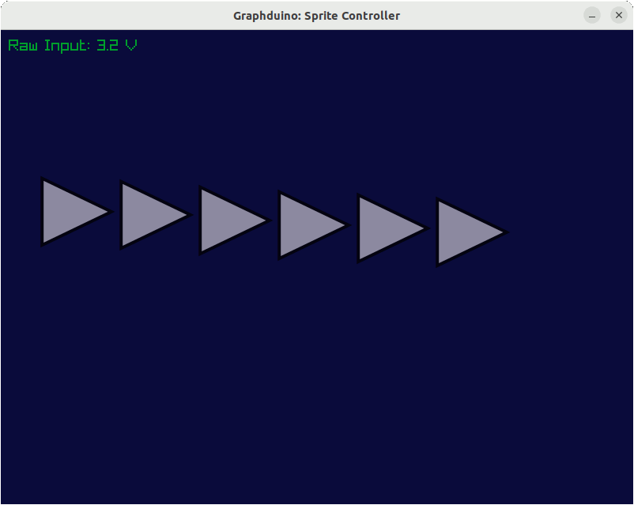

# Graphduino: Graphical Data Display for Arduino

This little Swift package reads serial data from the Arduino,
and can display it using Raylib.

To use this, flash one of the firmwares to your Arduino, make sure the 
Sources/main.swift ArduinoBridge path matches your Arduino serial device path,
and run it:

    swift run

As long as your data is 9600 baud ASCII comma-separated float values,
you should only need to modify main.swift.  If you want some other format,
or a faster baud rate, just put it into serial.swift!

## Setup

This supposedly works out of the box on Windows or Mac OS.  (Needs testing!)

On Linux, you'll need to install some graphics libraries for Raylib to call:

https://github.com/raysan5/raylib/wiki/Working-on-GNU-Linux#install-required-libraries

## License

This project is public domain, and can be used, extended, modified, and redistributed for any purpose.

